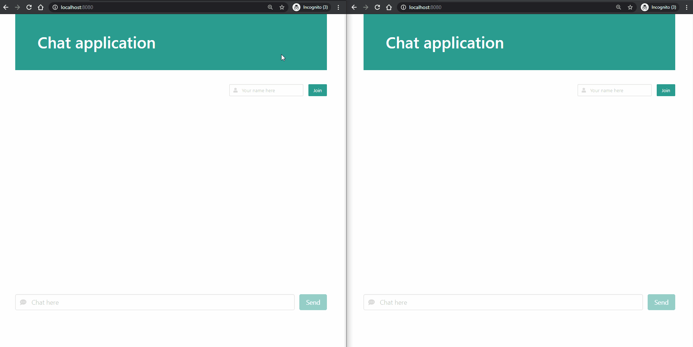

# chat-application

A simple chat application.  
Users can join on the unique channel.  
Users can consult the chat history by entering `history N` where N is a number between 5 and 100.

The application is hosted [here](http://34.126.105.217/)



## Frontend

Built with 
- Vue.js 3
- Vuex
- Bulma

### Run locally

```
cd chat-application-frontend
npm install
npm run serve
```

### Run with Docker

(linked to backend running on `34.126.105.217`)
```
cd chat-application-frontend
docker build . -t chat-application-frontend
docker run -it -p 8080:80 --rm chat-application-frontend
```


## Backend

Built with
- Kotlin (Java 14)
- Spring Boot

It uses standard WebSockets. For simplicity, it does not rely on STOMP protocol / message broker.

### Run locally

```
cd chat-application
gradlew bootRun
```

### Run with Docker

```
cd chat-application
docker build . -t chat-application
docker run -it -p 80:80 --rm chat-application
```
